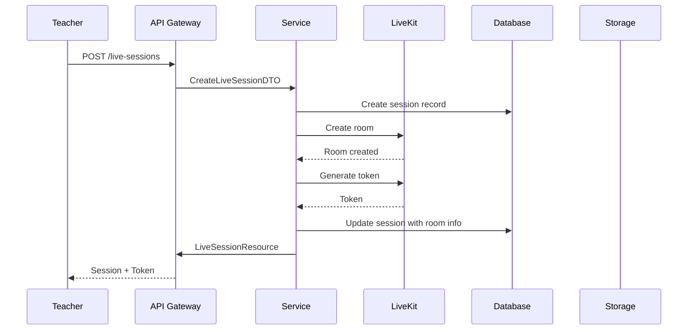
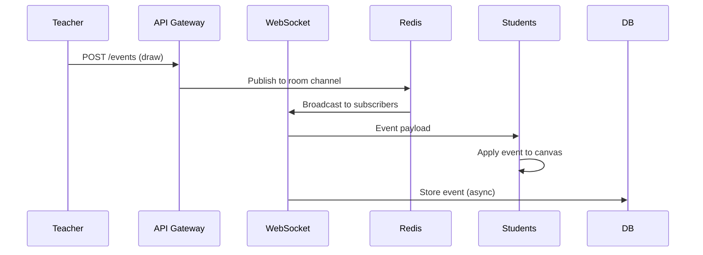

# Distance Learning Platform - Architecture Documentation

## Table of Contents
1. [High-Level Architecture](#high-level-architecture)
2. [System Components](#system-components)
3. [Data Flow](#data-flow)
4. [Technology Stack](#technology-stack)
5. [Deployment Architecture](#deployment-architecture)
6. [Security Architecture](#security-architecture)
7. [Scalability Strategy](#scalability-strategy)

---

## High-Level Architecture

### Architecture Overview

```
┌─────────────────────────────────────────────────────────────────────────┐
│                              Client Layer                                 │
├─────────────────────────────────────────────────────────────────────────┤
│  Android App (Kotlin)        │  Web App (Vue 3 / React)                │
│  - LiveKit Android SDK        │  - LiveKit JS SDK                       │
│  - PDF Renderer               │  - PDF.js                                │
│  - Canvas Overlay             │  - Fabric.js / Konva.js                 │
│  - Audio Recorder/Player       │  - MathLive + KaTeX                     │
│  - Whiteboard Canvas          │  - Whiteboard Canvas                    │
└─────────────────────────────────────────────────────────────────────────┘
                                          │
                                          ▼
┌─────────────────────────────────────────────────────────────────────────┐
│                            API Gateway Layer                             │
├─────────────────────────────────────────────────────────────────────────┤
│  Laravel 12 API Routes       │  Laravel Sanctum Auth                    │
│  - Rate Limiting              │  - JWT Tokens                            │
│  - Request Validation         │  - Role-Based Access Control             │
│  - Response Formatting        │  - Signed URLs                           │
└─────────────────────────────────────────────────────────────────────────┘
                                          │
                                          ▼
┌─────────────────────────────────────────────────────────────────────────┐
│                           Application Layer                              │
├─────────────────────────────────────────────────────────────────────────┤
│  Controllers                 │  Services                                │
│  - LiveSessionController     │  - LiveKitService                        │
│  - AssetController           │  - RecordingService                      │
│  - EventController           │  - EventStorageService                   │
│  - RecordingController       │  - PlaybackService                       │
│                              │  - NotificationService                    │
├──────────────────────────────┼──────────────────────────────────────────┤
│  Form Requests               │  Repositories                            │
│  - LiveSessionRequest        │  - LiveSessionRepository                 │
│  - AssetRequest              │  - AssetRepository                       │
│  - EventRequest              │  - EventRepository                       │
│  - RecordingRequest          │  - RecordingRepository                   │
├──────────────────────────────┼──────────────────────────────────────────┤
│  API Resources               │  DTOs                                    │
│  - LiveSessionResource       │  - LiveSessionDTO                        │
│  - AssetResource             │  - EventDTO                              │
│  - EventResource             │  - RecordingDTO                          │
│  - RecordingResource         │  - ParticipantDTO                        │
├──────────────────────────────┼──────────────────────────────────────────┤
│  Policies                    │  Events & Listeners                       │
│  - LiveSessionPolicy         │  - SessionStarted                        │
│  - AssetPolicy               │  - SessionEnded                          │
│  - EventPolicy               │  - UserJoined                            │
│  - RecordingPolicy           │  - UserLeft                              │
└─────────────────────────────────────────────────────────────────────────┘
                                          │
                                          ▼
┌─────────────────────────────────────────────────────────────────────────┐
│                           Infrastructure Layer                           │
├─────────────────────────────────────────────────────────────────────────┤
│  Queue System                │  Cache Layer                             │
│  - Laravel Horizon           │  - Redis (Sessions, Cache, Pub/Sub)     │
│  - Redis Queue               │                                          │
├──────────────────────────────┼──────────────────────────────────────────┤
│  Real-Time Communication     │  File Storage                            │
│  - Laravel Reverb / WS       │  - Local / S3 / Wasabi / R2              │
│  - LiveKit SFU               │  - PDFs, Images, Recordings              │
├──────────────────────────────┼──────────────────────────────────────────┤
│  Database                    │  Background Jobs                          │
│  - MySQL 8.0                 │  - Recording Processing                  │
│  - Migrations                │  - Audio Compression                      │
│  - Eloquent ORM              │  - Event Indexing                        │
│                              │  - Cleanup Tasks                         │
└─────────────────────────────────────────────────────────────────────────┘
                                          │
                                          ▼
┌─────────────────────────────────────────────────────────────────────────┐
│                         External Services                                │
├─────────────────────────────────────────────────────────────────────────┤
│  LiveKit Server              │  Notification Services                   │
│  - Audio Streaming           │  - Firebase Cloud Messaging              │
│  - Room Management           │  - Email Notifications                    │
│  - Token Generation          │  - Push Notifications                    │
│  - Recording                 │                                          │
└─────────────────────────────────────────────────────────────────────────┘
```

---

## System Components

### 1. Client Layer

#### Android Application
- **Kotlin** with coroutines for async operations
- **LiveKit Android SDK** for real-time audio
- **PDF Renderer** (PdfRenderer or custom implementation)
- **Canvas Overlay** for whiteboard drawing
- **Audio Recorder/Player** with Opus codec support

#### Web Application
- **Vue 3** or **React** with TypeScript
- **LiveKit JS SDK** for WebRTC audio
- **PDF.js** for PDF rendering
- **Fabric.js** or **Konva.js** for canvas manipulation
- **MathLive + KaTeX** for LaTeX equation rendering

### 2. API Gateway Layer

#### Authentication & Authorization
- **Laravel Sanctum** for API authentication
- JWT tokens with expiration
- Role-based access control (Teacher, Student, Admin)
- Signed URLs for secure asset access

#### Request Processing
- Rate limiting per user/IP
- Request validation using Form Requests
- Response formatting using API Resources
- Error handling with proper HTTP status codes

### 3. Application Layer

#### Controllers
Handle HTTP requests and delegate to services:
- `LiveSessionController` - Session CRUD and lifecycle
- `AssetController` - PDF/Image upload and management
- `EventController` - Real-time event ingestion
- `RecordingController` - Recording management and playback

#### Services
Business logic implementation:
- `LiveKitService` - Room creation, token generation
- `RecordingService` - Audio/event recording coordination
- `EventStorageService` - Event persistence and retrieval
- `PlaybackService` - Synchronized playback logic
- `NotificationService` - Multi-channel notifications

#### Repositories
Data access abstraction:
- `LiveSessionRepository` - Session data operations
- `AssetRepository` - Asset file operations
- `EventRepository` - Event query operations
- `RecordingRepository` - Recording data operations

#### DTOs (Data Transfer Objects)
- `LiveSessionDTO` - Session data transfer
- `EventDTO` - Event data transfer
- `RecordingDTO` - Recording metadata
- `ParticipantDTO` - Participant information

### 4. Infrastructure Layer

#### Real-Time Communication
- **Laravel Reverb** or native WebSockets for signaling
- **LiveKit SFU** for audio streaming (1000+ concurrent users)
- Redis pub/sub for event broadcasting

#### Queue System
- **Laravel Horizon** for queue monitoring
- Redis-backed queues for async processing
- Jobs for: recording processing, compression, cleanup

#### Cache Layer
- **Redis** for:
  - Session state caching
  - Active participants tracking
  - Event buffering
  - Rate limiting

#### File Storage
- Configurable disks: Local, S3, Wasabi, R2
- Separate buckets for:
  - PDFs/Images (original assets)
  - Audio recordings (compressed)
  - Event logs (JSON)

### 5. External Services

#### LiveKit
- **SFU (Selective Forwarding Unit)** for audio
- Room management API
- Token generation with custom claims
- Built-in recording capabilities

---

## Data Flow

### Live Session Flow

```
Teacher                          Server                          Student
   │                                │                                │
   │  1. Create Session             │                                │
   ├───────────────────────────────>│                                │
   │                                │  2. Create LiveKit Room         │
   │                                ├───────────────────────────────>│
   │                                │  3. Generate Token             │
   │                                │<───────────────────────────────┤
   │  4. Return Session + Token    │                                │
   │<───────────────────────────────┤                                │
   │                                │                                │
   │  5. Upload PDF Asset          │                                │
   ├───────────────────────────────>│                                │
   │                                │  6. Store Asset                 │
   │                                ├───────────────────────────────>│
   │  7. Asset URL Returned         │                                │
   │<───────────────────────────────┤                                │
   │                                │                                │
   │  8. Join Room (LiveKit)        │                                │
   ├───────────────────────────────>│                                │
   │                                │                                │
   │                                │  9. Student Joins               │
   │                                │<───────────────────────────────┤
   │                                │                                │
   │  10. Start Audio Stream        │                                │
   ├────────────────────────────────┼───────────────────────────────>│
   │                                │                                │
   │  11. Draw Event                │                                │
   ├───────────────────────────────>│  12. Broadcast via WS           │
   │                                ├───────────────────────────────>│
   │                                │                                │
   │  13. Equation Event            │                                │
   ├───────────────────────────────>│  14. Broadcast via WS           │
   │                                ├───────────────────────────────>│
   │                                │                                │
   │  15. Page Change Event         │                                │
   ├───────────────────────────────>│  16. Broadcast via WS           │
   │                                ├───────────────────────────────>│
   │                                │                                │
   │  17. End Session               │                                │
   ├───────────────────────────────>│  18. Stop Recording             │
   │                                │  19. Process Recording          │
   │  20. Recording Ready            │                                │
   │<───────────────────────────────┤                                │
```

### Playback Flow

```
Student                          Server                         Storage
   │                                │                                │
   │  1. Request Recording          │                                │
   ├───────────────────────────────>│                                │
   │                                │  2. Fetch Recording Metadata   │
   │                                ├───────────────────────────────>│
   │                                │  3. Fetch Audio File           │
   │                                ├───────────────────────────────>│
   │                                │  4. Fetch Event Log            │
   │                                ├───────────────────────────────>│
   │                                │                                │
   │  5. Return Recording Data     │                                │
   │<───────────────────────────────┤                                │
   │                                │                                │
   │  6. Load PDF Asset             │                                │
   ├───────────────────────────────>│                                │
   │                                │  7. Return Asset URL           │
   │<───────────────────────────────┤                                │
   │                                │                                │
   │  8. Play Audio                 │                                │
   │  9. Apply Events on Timestamp  │                                │
```

---

## Technology Stack

### Backend
| Component | Technology | Version |
|-----------|-----------|---------|
| Framework | Laravel | 12 |
| PHP | PHP | 8.2 |
| Database | MySQL | 8.0 |
| Cache/Queue | Redis | 7.x |
| Real-Time | Laravel Reverb / WebSockets | Latest |
| Audio SFU | LiveKit | Latest |
| Auth | Laravel Sanctum | Latest |

### Frontend Web
| Component | Technology | Version |
|-----------|-----------|---------|
| Framework | Vue 3 / React | Latest |
| PDF Renderer | PDF.js | Latest |
| Canvas | Fabric.js / Konva.js | Latest |
| Math | MathLive + KaTeX | Latest |
| Audio | LiveKit JS SDK | Latest |
| Build Tool | Vite | Latest |

### Android
| Component | Technology | Version |
|-----------|-----------|---------|
| Language | Kotlin | Latest |
| LiveKit | LiveKit Android SDK | Latest |
| PDF | PdfRenderer / Custom | Latest |
| Build | Gradle (Kotlin DSL) | Latest |

---

## Deployment Architecture

```
┌─────────────────────────────────────────────────────────────────────────┐
│                              Load Balancer                               │
│                            (Nginx / AWS ALB)                              │
└─────────────────────────────────────────────────────────────────────────┘
                                  │
                    ┌─────────────┴─────────────┐
                    ▼                           ▼
        ┌───────────────────────┐   ┌───────────────────────┐
        │   Application Server  │   │   Application Server  │
        │   (Laravel / PHP-FPM) │   │   (Laravel / PHP-FPM) │
        │   - API Endpoints     │   │   - API Endpoints     │
        │   - WebSocket Server  │   │   - WebSocket Server  │
        │   - Queue Worker      │   │   - Queue Worker      │
        └───────────────────────┘   └───────────────────────┘
                    │                           │
                    └─────────────┬─────────────┘
                                  ▼
        ┌───────────────────────────────────────────────────────────────┐
        │                         Redis Cluster                          │
        │  - Sessions          - Cache           - Pub/Sub            │
        │  - Queue             - Rate Limiting   - Locks               │
        └───────────────────────────────────────────────────────────────┘
                                  │
                    ┌─────────────┴─────────────┐
                    ▼                           ▼
        ┌───────────────────────┐   ┌───────────────────────┐
        │     MySQL Cluster     │   │      LiveKit SFU       │
        │  - Master            │   │  - Audio Streaming     │
        │  - Read Replicas     │   │  - Room Management     │
        │  - Backup            │   │  - Recording           │
        └───────────────────────┘   └───────────────────────┘
                    │                           │
                    └─────────────┬─────────────┘
                                  ▼
        ┌───────────────────────────────────────────────────────────────┐
        │                    Object Storage (S3/R2/Wasabi)              │
        │  - PDFs/Images       - Audio Recordings   - Event Logs       │
        └───────────────────────────────────────────────────────────────┘
```

---

## Security Architecture

### Authentication Flow
```
1. User Login
   ↓
2. Validate Credentials
   ↓
3. Generate Sanctum Token
   ↓
4. Return Token with Permissions
   ↓
5. Client includes Token in Header
   ↓
6. Middleware validates Token
   ↓
7. Policy checks Authorization
   ↓
8. Request Processed
```

### Security Layers

#### 1. Network Security
- HTTPS/TLS 1.3 for all communications
- WAF (Web Application Firewall)
- DDoS protection
- IP whitelisting for admin endpoints

#### 2. Application Security
- SQL Injection prevention via Eloquent
- XSS protection via escaping
- CSRF protection for state-changing requests
- Rate limiting per endpoint
- Input validation via Form Requests

#### 3. Data Security
- Encryption at rest (PDFs, audio)
- Encryption in transit (TLS)
- Signed URLs for asset access
- Token expiration and refresh
- Audit logging for sensitive operations

#### 4. LiveKit Security
- Room access control via tokens
- Token expiration (session duration)
- Participant role claims (host/guest)
- Room password protection (optional)

---

## Scalability Strategy

### Horizontal Scaling

#### Application Servers
- Stateless design allows easy horizontal scaling
- Session state stored in Redis
- WebSocket connections distributed via Redis pub/sub
- Auto-scaling based on CPU/memory metrics

#### Database Scaling
- Read replicas for read-heavy operations
- Database sharding by course_id for future growth
- Connection pooling
- Query optimization with proper indexing

#### LiveKit Scaling
- SFU can be deployed as a cluster
- Automatic load balancing across SFU nodes
- Regional deployment for low latency

### Performance Optimization

#### Caching Strategy
- Session metadata: Redis (TTL: 1 hour)
- Active participants: Redis (TTL: 5 minutes)
- Event buffer: Redis (TTL: 24 hours)
- API responses: HTTP cache headers

#### Queue Optimization
- Separate queues for different job types
- Priority queues for time-sensitive jobs
- Job batching for bulk operations
- Failed job retry with exponential backoff

#### Database Optimization
- Proper indexing on foreign keys
- Partitioning large tables (events)
- Query result caching
- N+1 query prevention via eager loading

### Monitoring & Observability

#### Metrics to Track
- Active sessions count
- Concurrent participants per session
- Audio stream latency
- Event delivery latency
- Queue depth and processing time
- Database query performance
- API response times

#### Logging Strategy
- Structured JSON logs
- Log levels: DEBUG, INFO, WARNING, ERROR
- Centralized log aggregation (ELK/Loki)
- Alerting for critical errors

---

## Data Compression Strategy

### Audio Compression
- **Codec**: Opus (16 kbps - 64 kbps)
- **Sample Rate**: 16 kHz (sufficient for speech)
- **Channels**: Mono
- **Estimated size**: ~10-40 MB per hour

### Event Compression
- **Format**: JSON with gzip
- **Delta encoding for point sequences**
- **Run-length encoding for repeated events**
- **Estimated size**: ~1-5 MB per hour

### Total Recording Size
- **Target**: < 50 MB per hour
- **Breakdown**:
  - Audio: ~30 MB (Opus @ 32 kbps)
  - Events: ~5 MB (compressed JSON)
  - PDF Asset: ~10 MB (one-time)
  - Metadata: < 1 MB

---

## Integration with Existing LMS

### Course Integration
```
Course (existing)
    │
    ├── LiveSession (new)
    │   ├── Asset (PDF/Image)
    │   ├── Event (drawing, equations)
    │   ├── Recording
    │   └── Participant
    │
    └── Lesson (existing)
            └── LiveSession (optional link)
```

### Attendance Tracking
- Join/Leave events logged
- Duration calculated per participant
- Attendance percentage calculated
- Integration with existing attendance system

### Grade Integration (Optional)
- Recording view duration tracked
- Quiz results from live sessions
- Participation score based on interaction
- Export to gradebook format

---

## Sequence Diagrams

### Session Creation Sequence


### Real-Time Event Sequence


---

## Next Steps

1. ✅ Architecture Documentation
2. ⏭️ Database Schema Design
3. ⏭️ API Specification
4. ⏭️ Laravel Folder Structure
5. ⏭️ Implementation Phase
